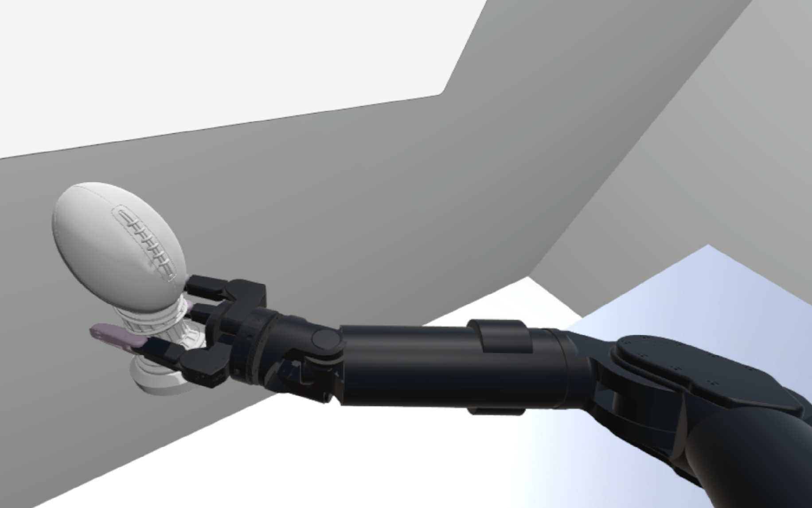
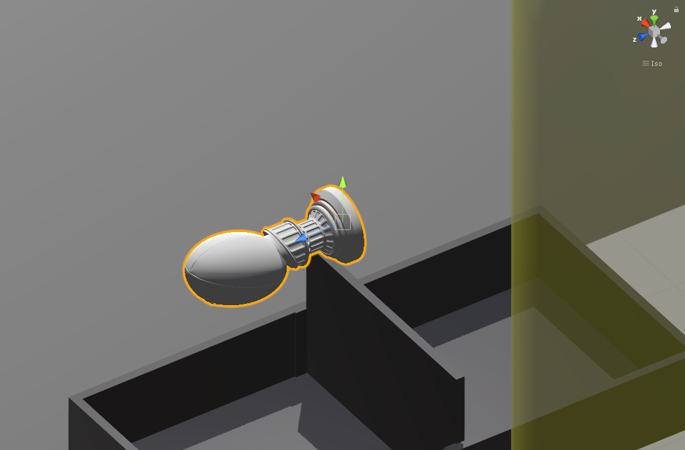
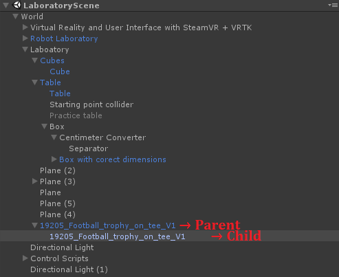
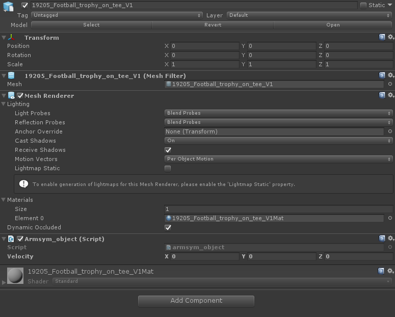
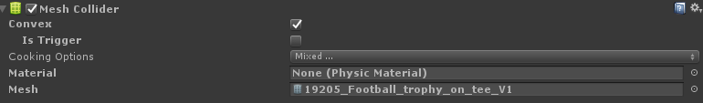
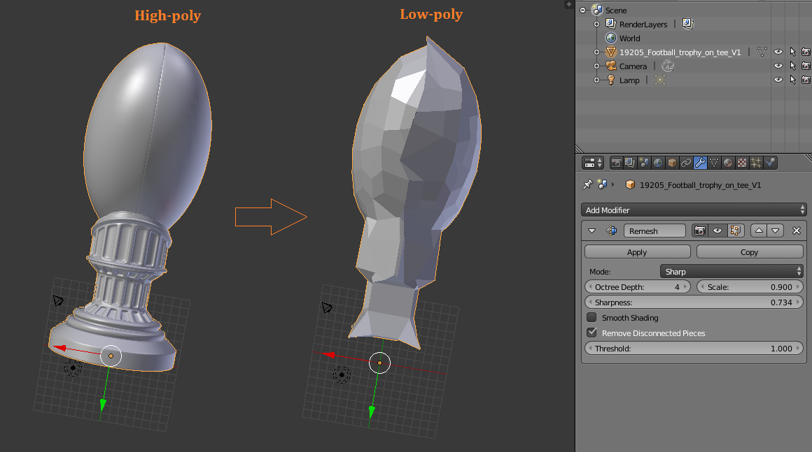
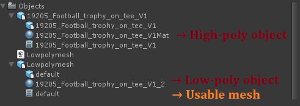
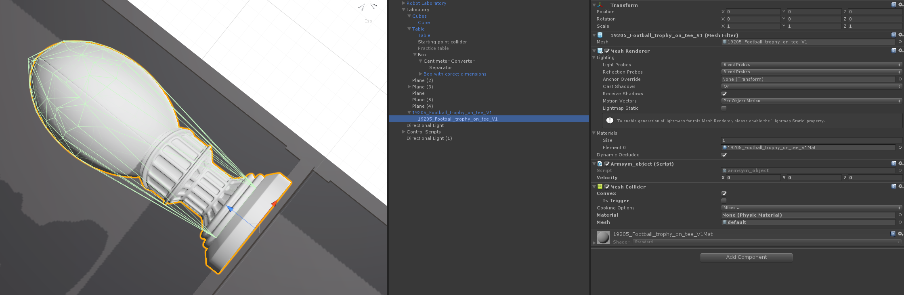

# Tutorial #1 - Grasping new objects

ArmSym's default experiment is the standardized box and blocks test, which uses small cubes as grippable objects. Nevertheless,  you can add other objects to your experiments using the class *"armsym_object"*. 

Let us illustrate the idea by allowing our robot to grasp a sport's football trophy, which you can download for personal use from [Free3D](https://free3d.com/3d-model/football-trophy-on-tee-v1--855683.html). You will need a 3D mesh of your desired object, in this case a .obj file.

## The pipeline
### Mesh renderer
First, you need to import the 3D model into Unity's assets. You can do so by placing the file in a new folder you name *Assets/Objects*. This will create a so-called prefab instance, which means that Unity will take care of the hierarchy and the components *Mesh Filter* and *Mesh renderer* that display in the game the 3D object.  You may insert this prefab instance in your scene by plugging and placing the model as a child of the laboratory, and correcting the scale and positions. We set the scale to be 0.05 in all directions, in a way that it can be correctly gripped by the robot. It should look like this:

You will see that the prefab instance consists of a parent and a child. It is good practice to set all the transforms (position, rotation and scales) on the parent, and all the dynamics and pick and place components on the child, which is the Game Object that contains the actual renderer. From now on, we will refer exclusively to this child. 

### ArmSym objects

The first instance that we require is an  *armsym_object* component. You can install it by clicking in "Add component". 

This component will allow our trophy to be manipulated by the robot using our grasping algorithm. It will also attach to the trophy a tag of *"GrippableObject"*, which will allow other objects in the game to recognize it as such.  Next, we need to make sure that the object is actually subject to forces, as part of the simulation from Unity's physics engine. This can be easily done by adding a [Rigid Body](https://docs.unity3d.com/ScriptReference/Rigidbody.html) component to the Game Object.

### Rigid body

Rigid bodies in Unity have certain properties, like weight o drag, that alter the way they behave after being exerted with bodies. As we want to have a simulation as realistic as possible, we keep the variable 'UseGravity' as *true*.

We recommend that you attach a Rigid Body with the properties you desire in your object. If you prefer not to do so, our class "armsym_object" will do it using preset standard parameters.

Thus far, we will have a graspable object that is subject to Unity's phisics simulation, and has a 3D render. Nevertheless,  this object does not interact with other Game Objects, because it does not have any collider mesh. This means that the 3D render cannot interact with the box, the table, or the hands of the robot, and therefore it will fall endlesly. To solve this, we need to install a collider.  

### Colliders

Colliders are invisible components that take care of physical interactions between objects. They have two basic functions. First,  they take care of sending collision messages once two meshes get in contact, which you can later access in code. Second, they allow interactions between rigid bodies within the Physics Engine. This ensures, for example, that the cubes do not to fall below the box as an effect of gravity. Please read carefully Unity's documentation in  [Colliders](https://docs.unity3d.com/Manual/CollidersOverview.html) before attaching a collider component.

Colliders in Unity can have the shapes of a custom 3D object by using the component *Mesh collider*, which converts the existing 3D mesh into a collider. To enable collisions between rigid bodies in realistic environments, it necessary that the mesh is convex, that is to say it has a convex hull. This can be ensured by ticking the *Is Trigger* checkbox. 

Nevertheless, it is often a problem that existing 3D meshes are high poly, meaning that they have an extensive number of vertices.  Unity will complain with the error  "user-provided hull must have less than 265 vertices".  There are several walkarounds for this issue. One is to simplify the collider by adding one - or several in child GameObjects - colliders with basic shapes, that is boxes, spheres and capsules.  We suggest you create a convex hull (see [this documentation link](https://docs.blender.org/manual/en/latest/modeling/meshes/editing/mesh/convex_hull.html) about the Blender utility).

Alternatively, one could design a low-poly mesh out of the high poly, again using Blender. This is [shown in this very simple tutorial](https://www.youtube.com/watch?v=Mm4X6_XjSBs). In short, you have to import your 3D object in Blender, add a modifier and select a *Remesh* modifier. Play a bit with the parameters, specially *Octree Depth* and *Sharpness*. This will effectively reduce the 3D object into a mesh that is tractable by Unity's mesh collider. 

Make sure to export the new mesh as a **new** 3D object (.obj), and simply drag the newly generated mesh into the *mesh* property of the collider. 

The result is a green convex hull that wraps the object. This hull is not seen in the game, but allows the object to have realistic collisions with other objects in the scene, and allows it to be in the scope of the robot gripper.

This pipeline will allow you to grasp any 3D object with a reasonable size.  We do not provide support for other types of grasping, but advanced users are welcome to experiment with ArmSym's *hand control* component and the hand's 3D model. 

The next step is to create a virtual wall that counts whenever an object goes through a certain region. We explain this in the **next tutorial**.
