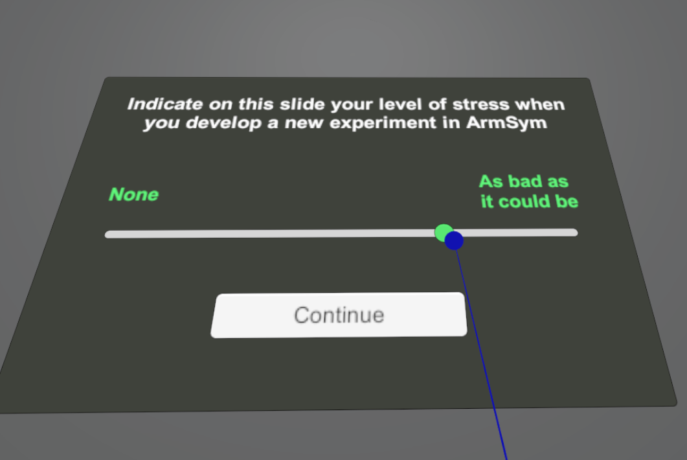
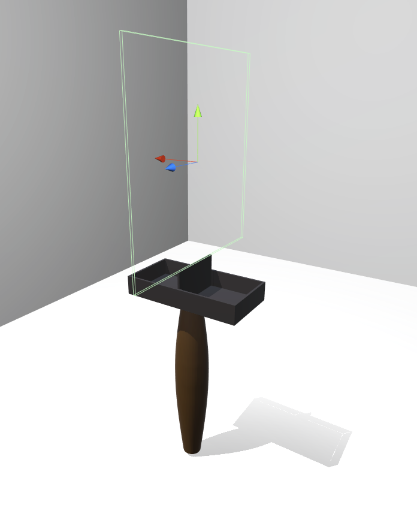
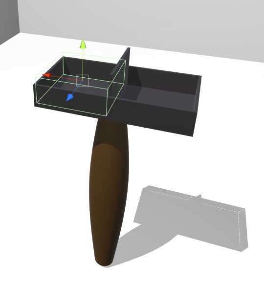
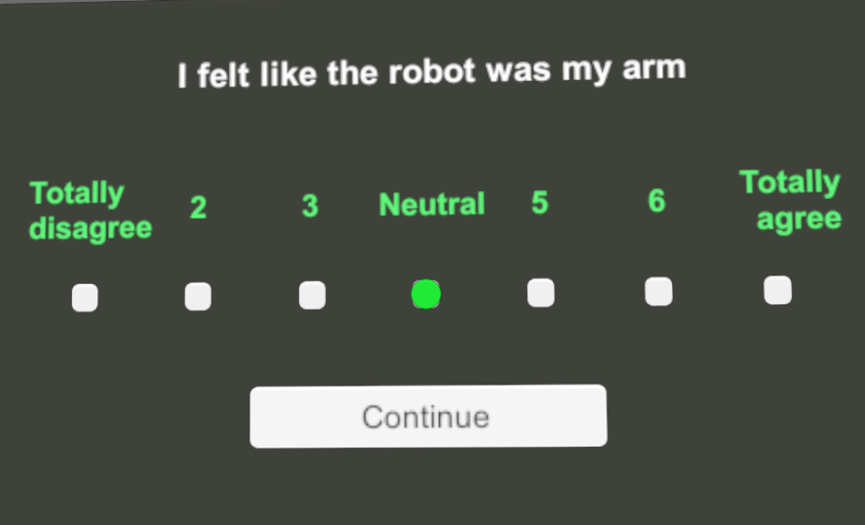

# Tutorial #2 - Quantifying user interaction

Generating information of value from user interaction requires measuring data in different shapes. In ArmSym, we have programmed two types of user interaction: 

*  Using performance metrics, which in a simplified way means recording of performance in timed tasks. This requires the system to measure the interaction of the user with objects in the scene. 
* Using surveys and questionnaires, which are widely used in psychology research and in human-robot interaction.

Here, we develop on how we have programmed these two, and how experimenters can use them and modify them at will.

## Using performance metrics 

VR has a relatively large physical workspace. The user can move the HMD and controllers in many different directions and positions within the scope of the Vive base stations. 

Experiments usually have either fixed-length trials or time-trial scenarios. In order to provide support for this, our code in ArmSym must count the interactions of the user with the graspable objects. This data is then saved using the Data Management procedure, explained in Tutorial 4. 

In order to count interactions, we must create invisible Game Objects in space that serve as virtual triggers for a counter.  In the case of the box and blocks test, it is an invisible box collider named *Counter Plate*, shown below:

*Counter Plate* has a component *Countermaster*, which we scripted in *Countermaster.cs*. This component has a field named *objectcounting*, which effectively counts collisions using Unity's native event system in the method *OnTriggerEnter( )*.

Since we don't want to count normal scene objects (for instance, the robot itself), a conditional statement counts the object only if its tag is *"GrippableObject"*, as we defined in the last tutorial.  We also added a refractory period. You may add other conditional statements, such as that the object has a certain name. 

~~~c#
void OnTriggerEnter(Collider other) {
    if (ExperimentClockUtils.trialphase==1){ // Only if this happens during a trial
        
		if (other.attachedRigidbody & other.tag == "GrippableObject") { // If it's a block or graspable object...

			if (Time.time - refractorytime > 0.25 & !HistoryList.Contains(other.name)){ // this avoids multiple cubes entering at the same time or cubes entering twice. 
                
                    refractorytime = Time.time;
                    objectcounting = objectcounting + 1;
                    HistoryList.Add(other.name);
                    TrialDataManagement.ArmSym_Message("BarrierCross", (float)objectcounting);
			}
		}
	}
}
~~~

We introduce a refractory time to avoid multiple objects cross at the same time, and also add a list of strings containing the names of the objects that have been added. Lastly, we save the data using our Data Management system, which will be explored in Tutorial 4.  Notice that we add the value of the counting as a float to the message. 

The invisible counting Game Objects do not necessarily have to be thin plates  — they can have all sorts of shapes, for instance spheres and boxes.  One example for this is an empty Game Object named *Original Compartment*, show below:

We use this object in order to instance another component we wrote, *countermaster_refinement.cs*. This is a box-and-blocks specific script: if a cube passes through the partition but falls back in the original compartment,  it has to be deducted from the score. As it was specific for our experiment, we will not go into details, albeit its working structure is very similar to *countermaster.cs*.  

## Using surveys

### The script for after-trial-questionnaire

We take care of ArmSym's after-trial questionnaires in the script *aftertrialquestionnaire.cs*.  This script defines the questions and the order in which they are asked. The trials in which questionnaires will be asked to the user can be defined using configuration files, which will be also introduced in Tutorial 4. 

We have programmed two types of questions: a 7 point Likert scale, shown below, or a Visual Analogue Scale that obtains a real number between 0 and 100, shown in the introduction of this tutorial.  Along with these types of questions, we have programmed the user interface and a raycaster system based on VRTK, a third party software. 

It is very simple to add new questions to the standard questionnaire. We have a blueprint class *Questionnaire entry*.  It is enough to create a new instance in the start method:

~~~c#
void Start () {
///(...)
	AllQuestions.Add(new QuestionareEntry { question= "This is a new non-Likert question", islikert=false});
		AllQuestions.Add(new QuestionareEntry { question= "This is a new Likert question", islikert=True});
///(...)
/// This is the one from the example above:
        AllQuestions.Add(new QuestionareEntry { question = " I felt like the robot was my arm", islikert = true });

}
~~~

Questions are asked one-at-the-time, and the user is given time to answer. The questions change once the user presses the button, which saves the data.  In its current version, ArmSys only supports fixed questionnaire lengths. That means that the same questions in the same order will be asked in the trials specified in the configuration files. The order of the questions is the same as the order in which they are instantiated in the code above.  

Before we go into the data management system, let's write a new control mode for our robot. 