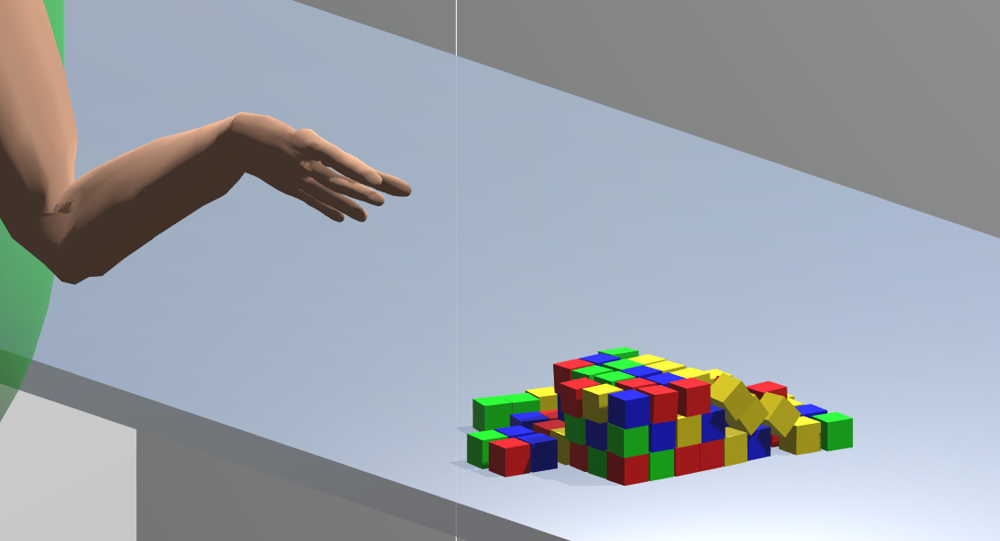
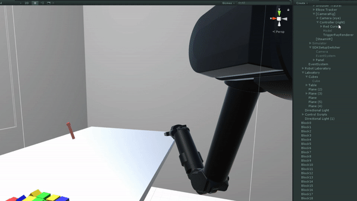
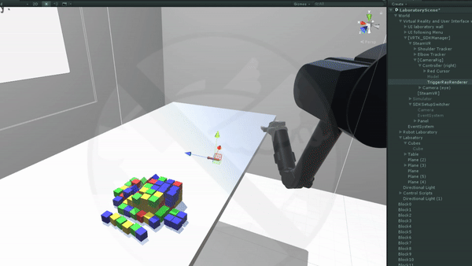

# Tutorial #3 - Writing a new control mode

One of the perks of Unity and C# is that it makes it easy to develop and deploy new applications. We did our best to allow you to customize you own experiment using ArmSym.  In order to do this, we implemented a modular script that lets you develop your own high-level control algorithms for the Barrett WAM.  We will be editing the script *armsym_controlmodes*.

We will build a new control mode that requires only the controller of the HTC Vive. The robot will be fixed on a base next to the table, and it will go to the position that the user commands when the side button is pressed. We will call this a *go-to* controller.

## The pipeline
### Knowing the parts 

We intend the script *armsym_controlmodes.cs* to be modular. This script has three main parts. First a subset of declarations, where dependencies are instanced. Second, some start/update methods, which choose the correct control mode and execute it. And third, a library of methods for the control modes. The distributed code includes the two control modes that we used in the validation experiment, plus the control mode of this tutorial.  

The relevant components that are linked to  *armsym_controlmodes* are:

* The robot component, which is an instance of the script *armsym_robot.cs*. This script takes care of the low level details of control of the robot, including the inverse kinematics algorithm and the Hartenberg & Denavit transformations.
* Game Objects from the shoulder & elbow Vive trackers. Our validation experiment included self-made mounts for Vive trackers. These will not be used in this tutorial. 
* Game Objects for the robot lab and the robot angles. 
* The instance of the Trial & Experiment Master, i.e., the scripts that rule how experiments and trials aredeveloped. 
* The GameObject from the Vive controller, and its event manager.
* The GameObject *RedCursor*. It is a small cursor that renders where in the 3D area the control  of the HTC Vive is. 
* A GameObject that creates a log (*armsym_logger*).

You don't have to modify or instantiate any of this, as we have done it already. But you can add other objects from the scene if you would like to call them from the code. 

We implemented a delegate system that assigns in runtime the control mode that the experiment will run. This means that you can create new control modes as methods, and Unity will only run one of them that it chooses on the "start" method. The control mode that is run in the experiment is selected from the configuration scene, according to the parameter *controlmode_idx* from Experiment Master. We will explain this process in detail in Tutorial 4.

~~~c#
switch (AAExperimentMasterScript.controlmode_idx) { 

            // Here, different control modes (which we set in the configuration scene) can allocate a method in the delegate. 
            case 0:
                controlmode_delegate = ControlMode0;
                break;

            case 1:
                controlmode_delegate = ControlMode1;
                break;

            case 2:
                controlmode_delegate = YOURMETHODHERE;
                break;

            default:
                { }

                break;
}
~~~

As you can see, we have implemented already two control modes. The index 0 and 1 correspond to prosthetic mimicking and inverse kinematics, respectively.  Control mode 2 refers to a simple cursor-based implementation of the go-to controller - the robot will go to a certain position after pushing the side button of the controller. But we have to write code for that, so let's dive into it.

### Adding a new method. 

Our *go-to* control  will be Control mode #2.  We begin with creating a new method...

~~~c#
///// New control mode!
private void ControlMode2() {

}
~~~

... and adding it to our start switch,

~~~c#
case 2:
    controlmode_delegate = ControlMode2;
    break;
~~~

Our method ControlMode2( ) will have all the code that we want to execute with the robot on *every* frame.  

In order to run tests with this control mode, you should fix the experiment parameter *controlmode_index*. In order to do this, you can either run the  "Configuration" scene  every time and introduce the number "2" in the control mode (see Tutorial 4) or temporally hard-code it.

### Establishing  a frame-per-frame controller
ControlMode2( ) will define what is going to happen with the robot during the execution of "update".  This means that it will be called **exactly once per frame**. Thus, you should write the things that you want to happen with the robot on frame-way basis. 

To simplify things, on the script *Armsym_robot.cs* we have written three different low-level controllers that you can use and call  while creating your own control mode:

1. A "direct control" - Use the method *robot_control.ExecuteAngle*( ) to simply configure the robot in a certain position.
2. Open-loop speed control  - Use the overload *robot_control.ExecuteSpeed( )* to move the joints of the robot with a certain speed.
3. A point controller, in which the movement profile is linear with time (that is, the robot makes constant steps towards the target).  - Use *robot_control.Set_target( )* to establish a target for this controller, and then use *robot_control.ReachForTarget( )* or *robot_control.AwayFromTarget( )* to navigate the robot to and
from the target.  We will be using this low-level controller here.

For the moment, we do not have a control with realistic acceleration profiles (e.g., ramps). You are welcome to add it to the script *armsym_robot.cs*! 

Next, we are going to build a collaborative task between the user and the robot. 

### Creating a collaborative control mode

First, we will have to fix the base of the robot, since we are not using a shoulder tracker:

~~~c#
robolab.transform.position = new Vector3(0.4f, 1.3f, -0.24f);
~~~

This vector is arbitrary; feel free to experiment with different robot base locations. The base of the robot will determine the workspace of reaching movements. If you place the robot too far away from the cubes, it is likely that it will not reach them.

We have created a new avatar that will show the user where the controller is in space, in the form of a cursor.  This Game Object, *RedCursor* is by default deactivated. We need to make sure that we see it in space, because we want to direct the robot to a position. We need to write:

~~~c#
if (!RedCursor.activeSelf) { RedCursor.SetActive(true); }
~~~

This will show our cursor in the screen, next to the robot. 

Now, we would like the robot to reach the position of the cursor every time the user asks the robot for it.  In order to do this, we can use *robot_control.SetTarget( )*, which will make the robot move towards a certain point in a realistic way.  

First, we need to get input from the user, which is handling the Vive's controller. The following method will return *True* if the user pressed one of the side buttons of the controller. We will use this as our input for the robot:

~~~c#
if (ControllerDevice.GetPressDown(SteamVR_Controller.ButtonMask.Grip)) {
    
    
}
~~~

If the user presses the button, no matter what the robot is doing, we will force a new target to the robot.  The target of the robot will be a vector, the difference between the location of the controller and the base of the robot. For convenience, we use the pre-allocated 7-dimensional vector *kinemtask*:

~~~c#
if (ControllerDevice.GetPressDown(SteamVR_Controller.ButtonMask.Grip)) {
     kinemtask = (ControllerGameObject.transform.position - robolab.transform.position);
    
}
~~~

Note that kinemtask is a vector in task space, that is to say cartesian. But we can only make  joint space inputs to *robot_control.SetTarget( )* method.  In order to do this, we should solve the inverse kinematics. We can grab the instance *WAM* from robot_control, run the method, and extract the field *WAM.kinemang*:

~~~c#

if (ControllerDevice.GetPressDown(SteamVR_Controller.ButtonMask.Grip)) {
      kinemtask = (ControllerGameObject.transform.position - robolab.transform.position);
      WAM.InverseKinematics(kinemtask.x, kinemtask.y, kinemtask.z, WAM.phi, ControllerGameObject.transform.forward, ControllerGameObject.transform.up);
      robot_control.SetTarget(WAM.kinemang,1);
 }
~~~

Note that we use the vectors *ControllerGameObject.transform.forward* and *ControllerGameObject.transform.up* as a way of constraining the axial and radial orientation of the end effector to be the same ones of the controller. For more information, please refer to the Inverse Kinematics comments within the script *armsym_robot.cs*. 

We can simply invoke the following method after the loop. it will make the robot reach the target frame-wise!

~~~c#
robot_control.ReachForTarget();
~~~

Aaaand... it reaches towards the target, but...

... the robot does not stop at the target. Fortunately the controller of the robot can provide us with a boolean that complains once the robot has reached a target. It is enough to write:

~~~c#
if (!robot_control.reached_target) {
	robot_control.ReachForTarget();
}
~~~

And, our robot stops at all the targets! Use the trigger button of the controller to grab cubes.

In the next tutorial, we will go through the methods for designing an experiment and saving the data using ArmSym. 

###### Note:  *We have used https://ezgif.com/ and wonderful OBS studio to make the gifs from this tutorial.* 
