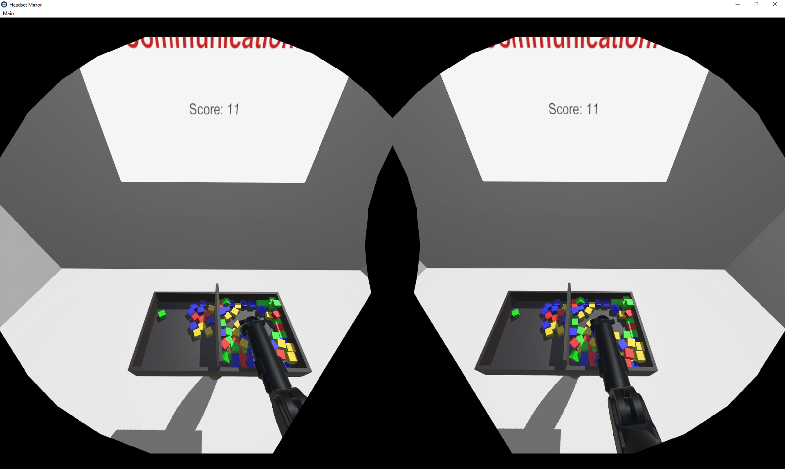
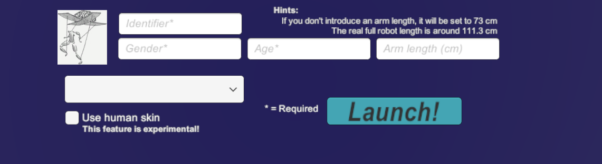
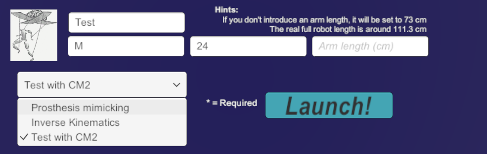
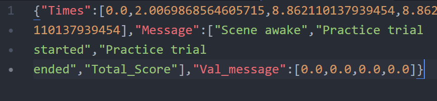
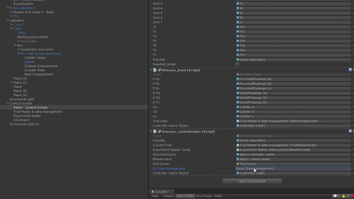

# Tutorial #4 - Saving the experimental data

The functional basis of any kind of science is data. ArmSym implements a very simple data pipeline in three parts. The first part, the *subject configuration*, lets you set and store the relevant experiment variables for a specific subject, and also any demographic data you may want to store digitally. The second part, the *trial data*, saves all the required data of the user performance during a trial in a convenient json file. Lastly, the *log data* saves all the robot joint values and important coordinates in a CSV file. In this tutorial, we explain to you how to deal with them, and how to modify the *Trial data* pipeline to fix your own. 




## Part 1: Subject configuration

### Configuration scene

When ArmSym is launched, a 2D scene will appear in the computer of the experimenter. This is the configuration scene, in which the information of a participant is introduced before an experiment. This is how it looks like:




This scene allows the experimenter to introduce an anonymous identifier for the participant, along with demographic data, and also select the experimental condition that the subject will undergo. 

Identifiers could be thought as a way of making the data pseudo-anonymous, for instance by naming a certain participant "Subject 4".  Once the experiment is launched, a new subfolder will be created in the directory Subjects, in ArmSym project root.  The file *identifier.json* will be created to store all the necessary variables for the system to run.  For instance:

~~~c#
{"identifier":"Subject 4","armlength":0.73,"gender":"Male","age":36,"controlmode":2,"trialswithquestionnaire":[1,4],"trialswithpause":[3],"numberoftrials":4,"triallength":40,"skin_idx":1}
~~~

The information on the experimental condition being tested (trials with pause, trial length, trials with questionnaire, etc.) are automatically loaded. These experimental conditions are pre-set in a configuration file. Let's create a new experimental condition for our *Control Mode 2*.

### Creating reproducible experimental conditions
In order to guarantee that subject data is independent, all the participants should have a access to the very same experiment.  With the intention of making this easier for the experimenter we have created configuration files that are automatically loaded in the configuration scene. 

All the json files in the folder *Assets/StreamingAssets/Experimental_conditions/* within ArmSym's root will be loaded in the application. This long path consists of folders that Unity ports to its standalone applications after building them (see Tutorial 5 for more information). 

The json files in the folder include hyperparameters for the experiments. For instance, these are the hyperparameters for the inverse kinematics condition in our validation experiment:

~~~c#
{"Display_name":"Inverse Kinematics", "controlmode":1,"trialswithquestionnaire":[2,6,10,14,18],"trialswithpause":[4,8,12,16],"numberoftrials":20,"triallength":60}
~~~

Let's create a new experimental condition for our control mode #2.  You can copy and paste the following template:

~~~c#
{"Display_name":"", "controlmode":,"trialswithquestionnaire":[],"trialswithpause":[],"numberoftrials":,"triallength":}
~~~

The lists "trialswithquestionnaire" and "trialswithpause" mark the trials after which ArmSym will display the user survey and the pause scene, respectively. In case the experimenter wants to deactivate them, it is enough leaving the vectors empty, i.e. *[ ]*. Display_name will be displayed for reference in the configuration scene, and only will be seen by the experimenter. Controlmode refers to the variable *controlmode_idx* that we introduced in *armsym_controlmode.cs*. For reference:

~~~c#
switch (AAExperimentMasterScript.controlmode_idx) {
    (...)
    case 2:
        controlmode_delegate = ControlMode2;
        break;
}
~~~

Finally, the number of trials and the trial length can be set as required in the experiment planning. Please notice that ArmSym *does not* yet support dinamically setting the trial length, or variable trial lengths within the experiment. 

Let's add the following to a new file *Test.json* in the said folder:

~~~c#
{"Display_name":"Test with CM2", "controlmode":2,"trialswithquestionnaire":[],"trialswithpause":[1],"numberoftrials":3,"triallength":20}
~~~

This will be automatically loaded if we run the configuration scene...




... and will automatically be added to the *identifier.json* file of the participant, newly created by the system:

~~~c#
{"identifier":"Test","armlength":0.7300000190734863,"gender":"M","age":24,"controlmode":2,"trialswithquestionnaire":[],"trialswithpause":[1],"numberoftrials":3,"triallength":20,"skin_idx":1}
~~~

## Part 2: Trial data pipeline 

Let's go back to the Laboratory Scene. ArmSym generates every trial a file named *trialdata.json*. Simply put, this is a text file that contains all the information of the interaction that the experimenter requires, and can be loaded in Python or MATLAB in order to perform an analysis. 



The trial data was re-engineered after the validation experiment in order to allow you to add your own variables. It works as a message-passing scheme. There is a component *DataManagement*, associated with the script *DataManagement.cs*, and attached to the Game Object 'Trial Master & Data Management. ' 

This script has an additional non-Unity class, named *DataManagementClass*, and it is the class whose instance is saved in the Json:

~~~c#
public DataManagementInstance trialdata = new DataManagementInstance();
~~~

This instance has three arrays of the same size attached to it, one array of floats with **Time of arrival**, one array of strings with **Message content** (e.g, "trial_started") and one array of floats with **Values**, which can store useful information about the message. A particular message can be reconstructed by taking the element of the same index in the tree arrays.  For example, in the image above, if we want to reconstruct " Practice trial started", we should take the second element of the other two arrays: the time of the message was 2.007 seconds, and the extra value message is 0 (no extra information).

Our message system already has the necessary message to store the data from the Box and Blocks test. But you can implement your own by instancing the component and running the method *ArmSym_Message( )*:

~~~c#
public void ArmSym_Message(string message, float? val_message=null)
~~~
This method requires a string, which is the content of the message,  and optionally it accepts a float that refers to the additional content of the message. If this value is indeed empty, it is stored as (0f) in the json file. 

To illustrate this, let's add some code that allows us to save the time stamp every time our robot is commanded to a new position, making use of the go-to controller and the control mode #2 that we developed in [Tutorial #3](/Tutorial 3 - Writing a new control mode.md).

This command happens in our script *armsym_controlmodes.cs*, so let's begin with opening it.  We must invoke our Data Management component, which is an object attached to a different Game Object. An easy way to do this is first creating an instance in the code, 

~~~c#
// For control mode 2.
public GameObject RedCursor; // An extra controller-based cursor. 
// We have to add this:
public datamanagement MyDataManagement; 
~~~
... and then using the drag-and-drop in Unity's editor to add the Game Object that contains the data management component:


This should be enough to create our instance. We now can call the method  *ArmSym_Message( )* from the code! We can call it in the Control Mode 2 method:

```c#
if (ControllerDevice.GetPressDown(SteamVR_Controller.ButtonMask.Grip)) {
    kinemtask = (ControllerGameObject.transform.position -         robolab.transform.position);
    WAM.phi = 0f*(float)Math.PI;
    WAM.InverseKinematics(kinemtask.x, kinemtask.y, kinemtask.z, WAM.phi,     ControllerGameObject.transform.forward, ControllerGameObject.transform.up);
    robot_control.SetTarget(WAM.kinemang,1);
    // We add: 
    MyDataManagement.ArmSym_Message("New Command");
}
```

And *voila*! Our data management system works! 


~~~c#
{"Times":[129.18544006347657,134.4623260498047,147.35836791992188,148.3661346435547,149.42213439941407,152.0515594482422,153.4324188232422,154.60000610351563,155.06219482421876,155.66397094726563,156.3111114501953,156.85556030273438,158.0032196044922,159.025390625,159.5654296875,160.19253540039063,162.78822326660157,164.64617919921876,165.6282501220703,167.08627319335938,169.06771850585938,170.46539306640626,171.4716033935547,172.44204711914063,173.8297882080078,177.48095703125,177.48095703125],"Message":["Scene awake","TrialStarted","New Command","New Command","New Command","New Command","New Command","GotACube","New Command","New Command","BarrierCross","ReleasedACube","New Command","New Command","New Command","New Command","New Command","New Command","New Command","New Command","New Command","New Command","New Command","New Command","New Command","TrialFinished","Total_Score"],"Val_message":[0.0,0.0,0.0,0.0,0.0,0.0,0.0,0.0,0.0,0.0,1.0,0.0,0.0,0.0,0.0,0.0,0.0,0.0,0.0,0.0,0.0,0.0,0.0,0.0,0.0,0.0,1.0]}
~~~

The non-zero entries of the *Val_message* array correspond to the count of cubes after "BarrierCross" and the total score, respectively.

## Part 3: Log data

ArmSyms provides by default a logger that saves almost-framewise the joint values of the robot, as well as the interaction with the controllers and trackers.  This will be created automatically in the trial folders under the name *Joint_Data.csv*. The  memory for this is pre-allocated, meaning that the system is efficient as it avoids garbage collection during runtime. 

You don't have to do anything to modify the logger - it will come off-the-shelf. Unfortunately, we do not provide support for modifying the logger and adding more variables that are of interest to the participants. Advanced Unity and C# users may modify the code to include new variables of interest. In case that non framewise saving of data is required, we encourage experimenters to use our Data Management script described in the previous section. 

The variables that are currently stored framewise, and that can be accessed by Python or Matlab in the CSV file, are:

* An index and timestamp.
* The seven joint values of the Barrett WAM (in degrees).
* The cartesian position of the controller (in meters).
* The position of the finger in the analogous 2D joystick from the Vive - defaults to 0 if not present.
* The position of the base of the robot, which is set to the shoulder tracker in the inverse kinematics.

Some example lines:

~~~csv
Idx		Time		th1		th2		th3		th4		th5		th6		th7		x_controller_in_space		y_controller_in_space		z_controller_in_space		x_trackpad		y_trackpad		x_baserobot_in_space		y_baserobot_in_space		z_baserobot_in_space
(...)
3631	44.86992	324.0887	133.1186	179.9998	75.16153	138.4255	300.7206	213.251	0.8027388	1.197742	0.08940418	0	0	0.4	1.3	-0.24
3632	44.88156	324.1831	133.1267	179.9998	75.37228	138.2251	300.4148	214.106	0.8043378	1.194947	0.09151711	0	0	0.4	1.3	-0.24
3633	44.89202	324.2775	133.1349	179.9998	75.58304	138.0247	300.1090	214.960	0.8061104	1.191845	0.0935852	0	0	0.4	1.3	-0.24
~~~