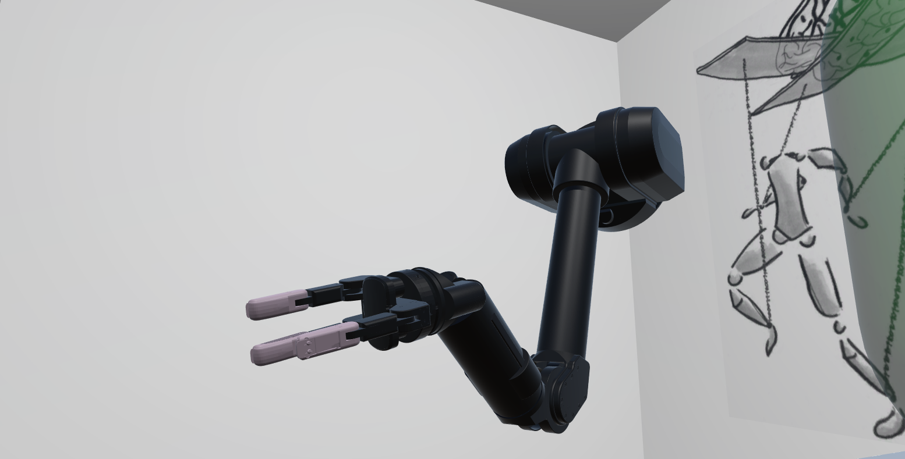
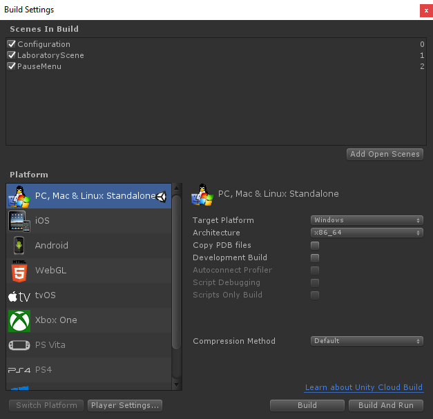
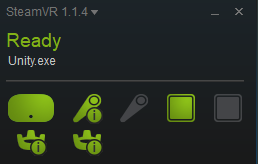

# Tutorial 5: General considerations with Unity and the HTC Vive

In the present tutorial, we write some general considerations and suggestions for good practice within ArmSym.

#### 1. Building ArmSym 
We strongly suggest that you build  ArmSym before running an experiment in your modified laboratory. Unity provides an option to build a compiled standalone, which runs independently from its editor. This is important for two reasons. First, the editor itself provides a significant overhead, so closing it increases the performance of the software. And second, it guarantees that all the experiments are done with the same code base, without accidental modifications.

The procedure is straightforward. First,  you must add all the scenes to the build list. Make sure the Configuration Scene is listed as #0, as it ensures that it runs first. Then, you should build it in any directory that you see fit. 

The experimental conditions folder will be automatically ported to the new build. Keep in mind that you need to update your experimental conditions before you build the app. Alternatively, you can find the ported folder in the Streaming Assets directory of the build. In Windows, this should be something like *Build_Data\StreamingAssets*. 

#### 2. Performance issues: Dealing with allocations and garbage collection. 
Applications in virtual reality must run very smothly, as they should guarantee that the frames run at the refreshing rate of the devices — 90 Hz for the HTC Vive. Otherwise, users can start feeling dizzy. In C#, not only [allocations but also garbage collection](https://unity3d.com/learn/tutorials/topics/performance-optimization/optimizing-garbage-collection-unity-games) may bring performance issue. In order to correct this, we strongly suggest that any code you write avoids allocations in runtime.   We suggest that you refer to the link for a complete and thorough explanation. 

The easiest workaround is very simple, and it consists of pre-allocating the memory in the *void start( )* method instead of in  *void update( )*. Consider the following example. Let's suppose we require a boolean variable while writing a control mode method, which runs in every frame (because it is called in *void update( )*. 

~~~c#
private void ControlMode6() {
///(your code here)
	if (something_happens){private bool something_happened=true;}
}
~~~

It will be best performance-wise if we declarate this boolean before, and initialize the varibale in the start method: 

~~~c#
//(...)
private bool something_happened;

//(...)

void start() {
	something_happened=false; // We initialize the variable here, so it's preallocated. We can change the value any time, tho.
}

//(...)

private void ControlMode6() {
///(your code here)
	if (something_happens){something_happened=true;}
}
~~~

#### 3. Dealing with Vive Controlllers and Trackers  
###### Caveat #1: Please note that ArmSym only supports simultaneous work with one Vive Controller at the time. It is theoretically possible to work with two, but this remains unstable and untested. At your own risk, you might reactivate the component *"Steam VR_Tracked Object"* in GameObject  *Controller (left)*.

###### Caveat #2: We tested the tracker setup in an environment with only one Vive camera. Activation of trackers might be slightly different if you use two cameras because of SteamVR indices.

Dealing with controllers and trackers may get a little messy in Unity. In order to know the position and orientation of the gadgets, we cast the physical controllers into game objects. Children of *[VRTK_SDKManager]*,  you will find in the hierarchy the shoulder & elbow trackers, and the two controllers. 

In order to distinguish these items from the incoming signals, Unity uses an index system. Most of the time this works fine, albeit some times there are bugs - we faced some of them in our validation experiments.  Let's assume that we want to run an Inverse Kinematics experiments - therefore we need one controller and two trackers. The procedure is as follows:

* First, run the standalone (or the game in the editor while testing). 
* This will open SteamVR. Make sure it is a fresh start, and that none of the devices of SteamVR is active. 
* Turn on **both** controllers, one after the other. This is necessary in order to preserve the original index of all the devices, even though one controller will not be used. 
* Turn on the shoulder tracker first and the elbow tracker second. 
* After the procedure, the second controller can be turned off in order to save battery. 

SteamVR looks like this after successfull activation:

Lastly, if you want to add a third or more Vive Trackers, you may do so by adding a new Game Object as a child of SteamVR — like the elbow and shoulder trackers—.  [This tutorial](https://www.youtube.com/watch?v=HyJPNzyADck) is a great introduction to working with Vive Trackers in Unity.

#### 4. VRTK 

We use VRTK as one of our third-party dependencies. VRTK is a toolkit for VR that allows developers to enhance the interfaces and build quick solutions in Unity. We cannot recommend it more. For more information of the capabilities of VRTK and certain tutorials, please visit [the VRTK website](https://vrtoolkit.readme.io/)

We use VRTK in several parts of ArmSym. Some examples:
* We implement the VRTK simulator, which allows us to run the code without having an active HTC vive headset connected. This is work in progress. 
* We have the VRTK raycaster for the surveys and the pause menu.
* We use the toolkit's structure for the SteamVR prefab hierarchy, which simplifies VRTK interaction.

