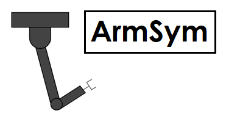

###  A simulated VR laboratory for human-robot control experiments :robot:

ArmSym is:

* Written in Unity and C#.
* Open source. 
* Compatible with the HTC Vive headset and trackers.

Welcome! :tada:

### What is ArmSym?
ArmSym,  stylized for 'arm simulation', is a Unity project for the HTC Vive.  Using a simulation of a 7 degrees-of-freedom Barrett WAM robotic arm, ArmSym features a trial-based system, a data management pipeline, and a user interface.  We tested ArmSym in one perceptual experiment contextualized in the domain of upper-limb prostheses, which we describe in a research paper.

### Can I use ArmSym?
We release the code with the aim of helping researchers design experiments in which a human controls and interacts with a robotic arm. We target scientists who work on high-level upper limb prosthesis control or assistive robotic manipulators mounted on wheelchairs. We do not intend ArmSym's as a clinical tool. 

### Contents
We release with ArmSym a virtual version of the box and blocks test of manual dexterity. Included are:

* Tutorials for researchers in the folder 'Documentation'.
* A basic toolbox for control in the script *'armsym_robot.cs'*.
* Three *off-the-shelf* high-level control setups, one for prosthesis mimicking (control mode 0), one for arm imitation also known as inverse kinematics (control mode 1) and a master/slave order system (control mode 2). 
* One extra [control mode for biosignal integration](https://github.com/SamuelBG13/ArmSym/blob/main/Assets/Scripts/armsym_controlmodes.cs#L212-L218) via LabStreamingLayer.
* Compatibility with the HTC vive controller and trackers.
* Hand control.
* A data management system. 

### Requirements
ArmSym requires a computer [capable of running VR](https://store.steampowered.com/app/323910/SteamVR_Performance_Test/) . We strongly suggest using a good graphics card for Unity and the experiments. GTX 1070/1080 are a good fit.  We also suggest using Unity 2017.3 or older.

### Dependencies
Please see our [dependency readme](https://github.com/SamuelBG13/ArmSym/blob/master/Assets/Plugins/Dependency_readme.md) for information on how to install ArmSym's dependencies.  

-----------------------------------
# The ArmSym Project

### Authors
ArmSym was developed at the [Brain-Computer Interfaces Group](https://ei.is.tuebingen.mpg.de/research_groups/brain-computer-interfaces-group) in the Max Planck Institute for Intelligent Systems. The Unity Project was developed by [M.Sc. Samuel Bustamante](https://www.is.mpg.de/person/sbustamante) (@SamuelBG13) and [Dr. Vinay Jayaram](https://ei.is.tuebingen.mpg.de/~vjayaram) under the supervision of [Prof. Dr. Moritz Grosse-Wentrup](https://ei.is.tuebingen.mpg.de/people/moritzgw). 

ArmSym was originally presented in Samuel's master's thesis, "A virtual reality environment for experiments in assistive robotics and neural interfaces".  

### License
Please refer to the [MIT License](LICENSE).

### Contributing
We welcome any contribution in the form of a Pull Request. Please don't hesitate to open an issue if you have any problems. 

### Copyright
Copyright (c) 2018, Max Planck Society - Max Planck Institute for Intelligent Systems.
